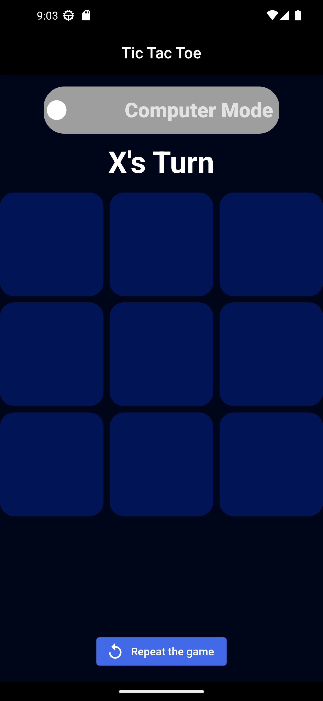
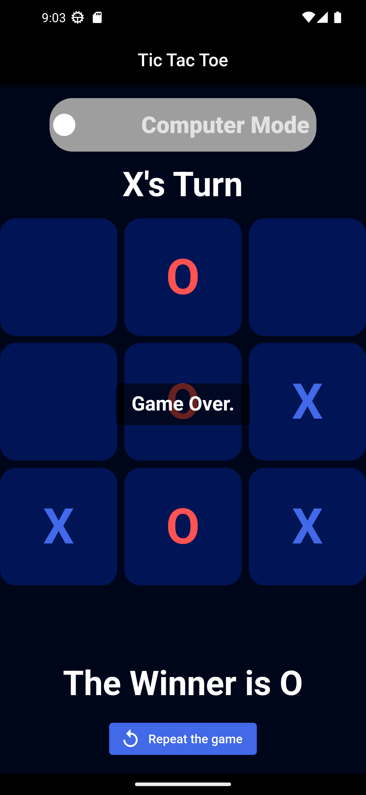
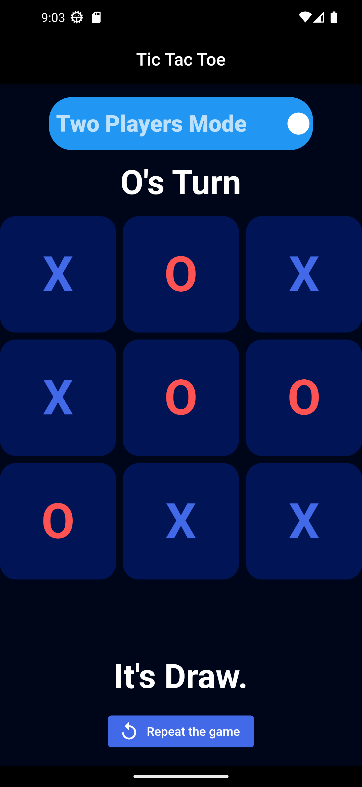

# Tic Tac Toe Game

<p align="center"></p>

A classic Tic Tac Toe game built using Flutter. Play against a friend or challenge the computer in a match of X's and O's!

## Features

- Two-player gameplay: Play against a friend locally.
- Computer mode: Play against an AI opponent.
- Interactive game board with tap-to-place functionality.
- Mode switch: Easily switch between 2 Players mode and Computer mode.
- Clean and user-friendly interface designed for easy gameplay.

## Screenshots

<div align="center">
  
  
  
</div>

## Installation

1. Clone the repository using the following command:

   ```bash
   git clone https://github.com/Mohamed-code-13/Tic-Tac-Toe-Flutter.git
   ```

2. Navigate to the project directory:

   ```bash
   cd Tic-Tac-Toe-Flutter
   ```

3. Install dependencies:

   ```bash
   flutter pub get
   ```

4. Run the app:
   ```bash
   flutter run
   ```

## How to play

1. Launch the app and select the desired mode: 2 Players or Computer.

2. For 2 Players mode, tap on empty squares on the board to place your X or O alternately.

3. For Computer mode, make your move and see the AI's response.

4. The first player to get three in a row (horizontally, vertically, or diagonally) wins the game.

5. If all squares are filled without a winner, the game ends in a draw.

## License

This project is licensed under the MIT License.
